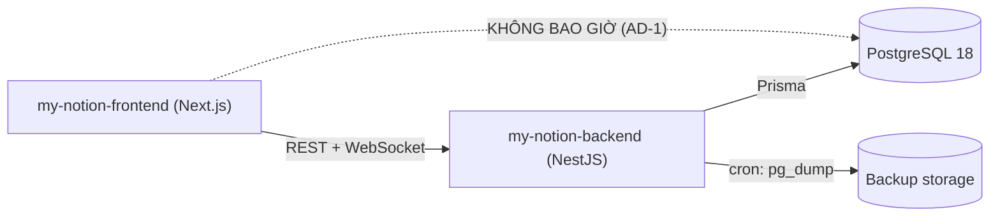
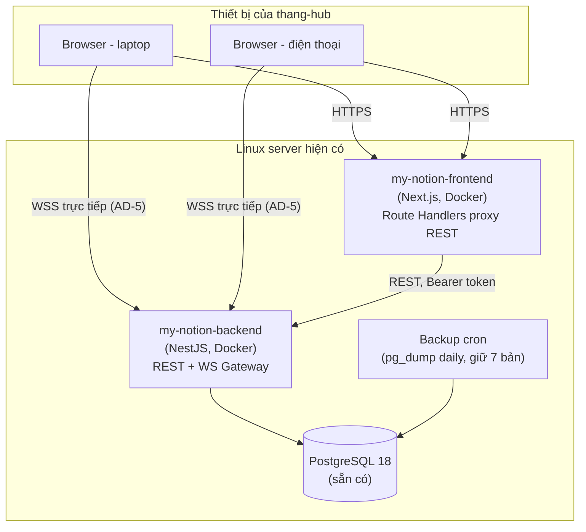
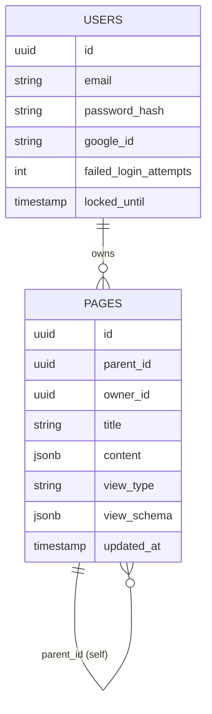

# Architecture Spine — My Notion

## Design Paradigm

Layered architecture (Controller → Service → Repository) trên backend NestJS, module hoá theo tính năng (auth, pages, sync, search...). Frontend Next.js (App Router) tổ chức theo feature-folder tương ứng 1-1 với module backend để dễ trace khi phát triển từng phần độc lập.

## Invariants & Rules

### AD-1 — Backend là nguồn chân lý duy nhất cho dữ liệu

- **Binds:** all
- **Prevents:** Frontend tự ý đọc/ghi PostgreSQL trực tiếp hoặc tự suy luận trạng thái lệch với server.
- **Rule:** my-notion-frontend chỉ được thay đổi dữ liệu qua REST API hoặc WebSocket event của my-notion-backend. Không có kết nối PostgreSQL nào từ phía frontend trong bất kỳ trường hợp nào.

### AD-2 — Nội dung Trang lưu dạng một tài liệu Tiptap/jsonb, không tách bảng Block

- **Binds:** FR-2, FR-4, FR-5, FR-6, FR-7, FR-8
- **Prevents:** Backend và frontend tự ý giả định cấu trúc dữ liệu block khác nhau (vd backend dựng bảng `blocks` rời trong khi frontend serialize nguyên document).
- **Rule:** Bảng `pages` có cột `content jsonb` chứa nguyên văn Tiptap JSON document của toàn Trang. Không có bảng `blocks` riêng ở v1. Mọi thao tác block (kéo-thả, đổi loại, slash command) xử lý ở tầng client (Tiptap), sau đó PUT nguyên `content` lên backend. **Node/mark vocabulary v1 (đóng băng, đổi phải qua cập nhật spine):** `paragraph`, `heading` (level 1–3), `bulletList`/`listItem`, `taskItem` (dùng TaskItem/TaskList chuẩn của Tiptap cho todo — không tự tạo custom node riêng), `image` (attrs `src`, `alt`). Ảnh: `src` luôn là **absolute URL do backend phục vụ** (vd `https://.../uploads/<asset-id>`), không dùng đường dẫn tương đối — để ảnh hiển thị đúng trên mọi thiết bị và còn dùng được khi export markdown (FR-15) ra ngoài app.

### AD-3 — Cây trang: adjacency list + recursive CTE

- **Binds:** FR-2, FR-3
- **Prevents:** Hai cách biểu diễn cây khác nhau xuất hiện trong cùng hệ thống (vd materialized path ở chỗ này, closure table ở chỗ khác).
- **Rule:** Bảng `pages` có cột `parent_id` (tự tham chiếu, `null` = root, `onDelete: Cascade` ở cấp DB trong `schema.prisma`). Xóa hẳn ở tầng DB (FK cascade) — tầng service **không** tự issue nhiều lệnh `DELETE` theo thứ tự con-trước-cha; recursive CTE chỉ dùng để **đọc** cây (sidebar, breadcrumb) và để **đếm số Trang con** hiển thị trong hộp thoại xác nhận xóa (FR-2) trước khi thực hiện `DELETE` trên chính Trang cha.

### AD-4 — Đồng bộ đa thiết bị: WebSocket broadcast tín hiệu, last-write-wins

- **Binds:** FR-10, FR-2, FR-3
- **Prevents:** Xây nhầm cơ chế CRDT/OT (Yjs) cho use-case chỉ một người dùng; hai phía tự suy diễn khác nhau về nội dung/hình dạng message WS; sidebar lệch trạng thái sau tạo/xóa/di chuyển Trang; một session tự xử lý ngược lại broadcast của chính nó; một session offline không bao giờ bắt kịp lại trạng thái mới nhất.
- **Rule:**
  - **Payload = tín hiệu, không phải dữ liệu.** WS message chỉ mang `{ type, pageId, updatedAt }` — **không** kèm `content` hay dữ liệu Trang. Nhận được event nào, client bắt buộc gọi lại REST (`GET /api/v1/pages/:id` hoặc `GET /api/v1/pages/tree`) để lấy dữ liệu mới nhất; client không được tự áp dữ liệu từ WS message vào state.
  - **Bộ sự kiện đầy đủ:** `page.created`, `page.updated`, `page.deleted`, `page.moved` (đổi `parent_id`). Import hàng loạt (FR-15) phát một event gộp `page.bulk_changed` (không phát N event riêng lẻ) — client xử lý event này bằng cách refetch toàn bộ cây.
  - **Không tự-echo:** gateway loại trừ chính socket vừa ghi ra khỏi broadcast (so theo socket id, không phải theo user id) — session vừa ghi đã có kết quả từ response REST của chính nó, không cần nhận lại qua WS.
  - **Bắt kịp khi reconnect:** mỗi khi WS (re)connect thành công, client bắt buộc gọi REST refetch Trang đang mở + cây Trang trước khi tin bất kỳ event nào tới sau đó — đây là cơ chế "bắt kịp" duy nhất (không có hàng đợi replay event khi mất kết nối).
  - Xung đột ghi giữa 2 lần PUT gần nhau giải quyết bằng `updated_at` mới nhất thắng (server-side), không CRDT.

### AD-5 — Auth tự chủ, không vendor SaaS

- **Binds:** FR-1
- **Prevents:** Phụ thuộc Clerk/Auth0 (mâu thuẫn mục tiêu tránh subscription của dự án), tự viết OAuth flow từ đầu (rủi ro bảo mật), hoặc hai phía tự đoán khác nhau về định dạng token/đường truyền/thời hạn phiên.
- **Rule:**
  - Auth.js v5 (self-hosted, mã nguồn mở, miễn phí) xử lý flow đăng nhập trong my-notion-frontend (Credentials provider cho email/password + Google OAuth provider). `[NOTE FOR PM: Auth.js v5 hiện ở trạng thái maintenance/bảo trì (đã sáp nhập hướng phát triển vào Better Auth từ 09/2025), không còn phát triển tính năng mới — chấp nhận rủi ro này vì vẫn nhận security patch và đủ ổn định cho dự án cá nhân; theo dõi lại nếu cần nâng cấp lớn sau này.]`
  - **Định dạng token:** Auth.js được cấu hình custom `encode`/`decode` để phát hành **JWT ký chuẩn HS256** (không dùng JWE mã hoá mặc định của Auth.js), dùng chung secret qua biến môi trường `AUTH_SECRET` giữa frontend và backend — đây là điều kiện bắt buộc để NestJS Guard (dùng `passport-jwt`/`jsonwebtoken` thường) verify được token mà không cần hiểu định dạng riêng của Auth.js.
  - **Đường truyền:** REST đi qua Next.js Route Handlers — Route Handler đọc session Auth.js phía server, đính token vào header `Authorization: Bearer <token>` khi gọi backend. WebSocket kết nối **thẳng** từ browser tới backend qua WSS (không proxy qua Next.js), token gửi kèm lúc handshake (query param hoặc `auth` payload của socket.io/ws).
  - **Vòng đời phiên:** JWT có hạn 30 ngày (sliding — mỗi lần dùng REST thành công thì Auth.js làm mới nếu gần hết hạn). Backend chỉ verify JWT lúc bắt tay (`handleConnection`) cho WebSocket, không re-verify từng message; khi socket bị ngắt (do hết hạn hoặc mất mạng) client bắt buộc reconnect bằng token mới nhất — khớp với cơ chế "bắt kịp khi reconnect" ở AD-4.
  - my-notion-backend không gọi Auth.js — chỉ verify JWT qua Guard riêng cho mọi REST call và lúc WebSocket handshake.

### AD-6 — Repo & CI/CD

- **Binds:** all
- **Prevents:** Hai repo tách biệt bị lệch version, khó release đồng bộ khi chỉ một người maintain cả hai phía.
- **Rule:** Một git repo `my-notion/` chứa `my-notion-backend/` và `my-notion-frontend/` như hai thư mục top-level độc lập (mỗi bên `package.json` riêng, không dùng Nx/Turborepo). GitHub Actions build & deploy Docker image riêng cho mỗi thư mục, trigger theo path-filter.

### AD-7 — Database View là thuộc tính hiển thị của Trang, không phải entity riêng

- **Binds:** FR-11, FR-12, FR-13
- **Prevents:** Backend tạo bảng `database_views` riêng trong khi frontend coi nó là một chế độ hiển thị của Page, gây lệch model.
- **Rule:** `pages.view_type` (enum: `document | table | kanban | calendar`, mặc định `document`) quyết định cách các Trang con hiển thị. `pages.view_schema jsonb` lưu định nghĩa cột tuỳ chỉnh khi `view_type ≠ document`. Trang con vẫn là các row bình thường trong bảng `pages`, không có bảng con riêng.



## Consistency Conventions

| Concern | Convention |
| --- | --- |
| Naming (entities, files, interfaces, events) | Bảng DB: `snake_case` số nhiều (`pages`, `users`). DTO/class: `PascalCase`. Field phía TypeScript: `camelCase`. WS event name: `resource.action` (vd `page.updated`). |
| Data & formats (ids, dates, error shapes, envelopes) | ID = UUID v4 (string) cho mọi entity. Timestamp: ISO 8601 UTC. Lỗi API: `{ "error": { "code": string, "message": string } }`. |
| State & cross-cutting (mutation, errors, logging, config, auth) | JWT lưu trong httpOnly cookie. Mọi REST endpoint dưới `/api/v1`. WS payload: `{ type, pageId, payload, updatedAt }`. Mutation luôn qua backend (AD-1). |

## Stack

| Name | Version |
| --- | --- |
| Node.js | 24 (Active LTS, 2026-07) |
| NestJS | v11 (Express v5 adapter) |
| Next.js | 16.2.x (React 19.2, Turbopack) |
| Tiptap | @tiptap/core, @tiptap/react ~3.29.x |
| Prisma ORM | v7.4.x |
| PostgreSQL | 18.4 |
| Auth.js (NextAuth) | v5 (xem `[NOTE FOR PM]` ở AD-5 — nay ở chế độ maintenance) |
| Tailwind CSS | 4.3.x |
| TanStack React Query | 5.101.x — server-state cache, invalidate khi nhận WS event (AD-4) |
| Zustand | 5.0.x — local UI state (sidebar, toggle editor), không lưu server-state |
| Docker + GitHub Actions | — |

## Structural Seed





```text
my-notion/
  my-notion-backend/
    src/
      auth/           # AD-5: JWT issue/verify guard, Google OAuth callback
      pages/          # FR-2,3: CRUD + cây (AD-3), content (AD-2), view (AD-7)
      sync/           # FR-10: WebSocket gateway (AD-4)
      search/         # FR-16 (Phase 3)
      prisma/
        schema.prisma
    Dockerfile
  my-notion-frontend/
    app/              # Next.js App Router
      (auth)/
      workspace/[pageId]/
    components/
      editor/         # Tiptap wiring (AD-2)
      database-view/  # table/kanban/calendar renderers (AD-7)
    lib/
      api-client.ts
      ws-client.ts
    Dockerfile
  .github/workflows/
    backend-deploy.yml
    frontend-deploy.yml
```

## Capability → Architecture Map

| Capability / Area | Lives in | Governed by |
| --- | --- | --- |
| FR-1 Auth | frontend `(auth)/` (Auth.js) + backend `auth/` (JWT Guard) | AD-5 |
| FR-2, FR-3 Page CRUD & cây | backend `pages/` | AD-1, AD-3 |
| FR-4–FR-8 Block editor | frontend `components/editor/` + `pages.content` | AD-2 |
| FR-9 Upload ảnh | backend `pages/` (endpoint upload) | AD-1 |
| FR-10 Đồng bộ đa thiết bị | backend `sync/` (WS gateway) | AD-4 |
| FR-11–FR-13 Database views | frontend `components/database-view/` + `pages.view_type/view_schema` | AD-7 |
| FR-14 Backup | infra cron (ngoài 2 app) | Deferred (seed) |
| FR-15 Markdown import/export | backend `pages/` (endpoint export/import) | AD-2 |
| FR-16 Tìm kiếm toàn văn | backend `search/` (Phase 3) | Deferred |
| FR-17–FR-20 Mở rộng (comment, mention, template, API công khai) | module chưa thiết kế (Phase 3) | Deferred |

## Deferred

- **Redis / pub-sub cho WS gateway** — chỉ cần khi scale lên nhiều instance backend cùng lúc; ở quy mô hiện tại (1 user, 1 instance) một WebSocket gateway trong-process là đủ, không cần Redis dù hạ tầng server đã có sẵn. `[NOTE FOR PM: đây và AD-7 dưới là 2 quyết định mình tự suy ra khi soạn spine, chưa hỏi trực tiếp lúc chốt — cả hai rủi ro thấp, nhưng xác nhận lại 1 lần khi review.]`
- **`view_schema` (AD-7) — chưa thiết kế đầy đủ.** AD-7 mới dừng ở "cột `view_schema jsonb` lưu định nghĩa cột" — **chưa** xác định: hình dạng cụ thể của column-definition, biến thể riêng cho Kanban (cột nào là swimlane) và Calendar (cột nào là ngày), nơi lưu **giá trị từng ô** (cell values) của Trang con, và cơ chế sắp thứ tự thủ công (kanban card order). Đây là một companion schema doc cần làm **trước khi** bắt đầu bất kỳ story nào của FR-11/12/13 — không suy diễn giữa chừng lúc code.
- **`view_type` chuyển đổi trên Trang đã có nội dung** — chưa quyết định cho phép chuyển `document → table/kanban` khi Trang con đã có `content` thật hay chỉ cho phép trên Trang rỗng; quyết định cùng lúc với companion schema doc ở trên.
- **Công cụ tìm kiếm toàn văn (FR-16)** — Postgres full-text search (tsvector) vs Meilisearch chưa chốt; quyết định khi bắt đầu Phase 3.
- **Module FR-17–FR-20** (comment, mention, template, API công khai) — chưa thiết kế, để tới khi Phase 3 bắt đầu triển khai thật.
- **Lưu trữ ảnh (FR-9)** — local disk volume vs S3-compatible storage chưa chốt; phụ thuộc hạ tầng server thực tế. **Ràng buộc dù chọn cách nào:** phải nằm trong vòng backup (FR-14) hoặc tự thân đã bền (vd S3 versioning) — nếu chọn local disk, phải thêm vào cron backup cùng `pg_dump`, không được để ảnh nằm ngoài mọi cơ chế backup.
- **Desktop app** — ngoài phạm vi spine này (PRD Non-Goals); sẽ cần spine riêng khi bắt đầu.
